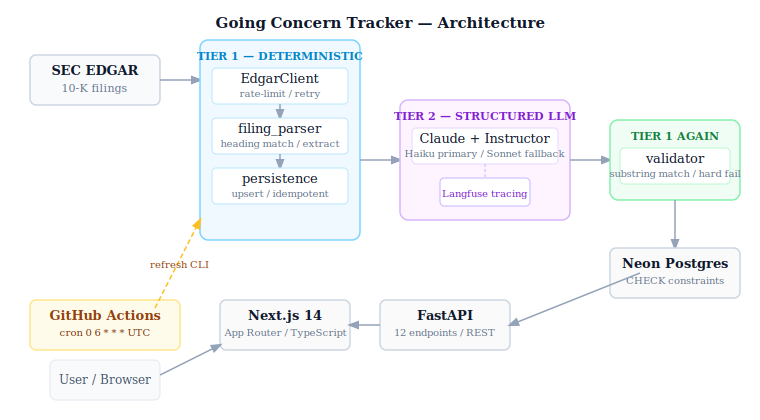

# Going Concern Tracker

[](apps/api/eval/golden_set.json) [](apps/api/eval/golden_set.json) [](.github/workflows/refresh-pipeline.yml) [](LICENSE)

A free public tracker of going-concern opinions in SEC filings. Every flag cited to source.

**Live demo:** *(fill after deployment — see [docs/deployment.md](docs/deployment.md))*  
**API docs:** `{backend-url}/api/docs`



## What This Is

When a company's auditor issues a "going-concern opinion," it means the auditor has formally stated in writing — under PCAOB Auditing Standard 2415 — that there is substantial doubt about the company's ability to continue operating within the next 12 months. It is one of the strongest signals of corporate distress in public financial reporting, and a powerful predictor of bankruptcy.

These opinions are buried inside 100–200 page SEC filings that almost nobody reads. Going Concern Tracker monitors a watchlist of US public companies daily, finds going-concern opinions in their auditor reports, and surfaces them with full citation to the source filing.

## Why It's Different

- **Free and open-source.** AlphaSense and similar services charge five-figure annual subscriptions for comparable capabilities.
- **Cited to source.** Every flag links to the exact paragraph in the auditor's report, with character offsets into the original document.
- **Architecturally honest.** LLMs never produce numbers or citations directly. The three-tier reliability architecture is documented in [docs/methodology.md](docs/methodology.md).
- **Continuously refreshed.** GitHub Actions runs the ingestion pipeline daily at 6am UTC. Total monthly operating cost: under $1.
- **Eval-set validated.** 100% precision and 100% recall on a 44-case hand-labeled golden set. See [docs/methodology.md](docs/methodology.md).
- **Defence-in-depth.** SQL CHECK constraints on every critical field (confidence range, CIK format, offset validity, quote consistency), applied after application-level Pydantic validation.

## Current Dataset

| | Count |
|---|---|
| Companies in database | 92 |
| Companies fully monitored | 35 |
| 10-K filings analyzed | 154+ |
| Critical going-concern flags | 6 (Bed Bath & Beyond, Tupperware, Spirit Airlines ×2, 23andMe, Wolfspeed) |
| Elevated going-concern flags | 2 (Seritage Growth Properties — 2025 and 2026) |
| Pipeline schedule | Daily at 06:00 UTC |
| Operating cost | Under $1/month |

## Architecture At A Glance

Three tiers, each with a specific reliability class:

1. **Tier 1 — Deterministic.** SEC EDGAR ingestion, HTML parsing, heading-matched auditor-report extraction, citation offsets, arithmetic with `Decimal`.
2. **Tier 2 — Structured LLM.** Going-concern classification via Claude + Instructor, with strict Pydantic schemas for all structured outputs.
3. **Tier 1 again — Deterministic validation.** Quote-presence checks via whitespace-normalized substring matching against the original document. Hard-fail on LLM hallucination — flags with unverifiable quotes are never written to the database.

See [docs/methodology.md](docs/methodology.md) for accuracy metrics, known limitations, and the canonical WeWork edge case.

## Tech Stack

| Layer | Technology |
|---|---|
| Backend | FastAPI, SQLAlchemy 2.0, Pydantic v2, Instructor, Anthropic Claude |
| Database | Neon Postgres (serverless, free tier) with SQL CHECK constraints |
| Frontend | Next.js 14 (App Router), TypeScript, Tailwind CSS, shadcn/ui |
| Observability | Langfuse Cloud (LLM tracing and cost monitoring) |
| Scheduling | GitHub Actions (daily 6am UTC, free tier) |
| Hosting | Vercel (frontend) + Render (backend) |

## Local Development

```bash
# Backend
cd apps/api
pip install -e ".[dev]"
cp .env.example .env          # fill in DATABASE_URL, ANTHROPIC_API_KEY, etc.
alembic upgrade head
uvicorn gct.main:app --reload  # http://localhost:8000/api/docs

# Frontend (separate terminal)
cd apps/web
npm install
cp .env.example .env.local    # set NEXT_PUBLIC_API_BASE_URL=http://localhost:8000/api
npm run dev                    # http://localhost:3000
```

## Testing

```bash
# Backend
cd apps/api
python -m pytest -v            # 175+ tests

# Frontend
cd apps/web
npm test                       # 42+ tests
npm run build                  # type-check + production build

# Eval (accuracy benchmark)
cd apps/api
python -m gct.cli.eval         # 44-case golden set, expect 100% precision/recall
```

## Continuous Ingestion

The pipeline runs automatically every day at 06:00 UTC via `.github/workflows/refresh-pipeline.yml`. Each run:

1. Loads the watchlist from `apps/api/data/watchlist.yaml` (35 monitored CIKs)
2. Queries SEC EDGAR for new 10-K filings since the last run
3. Downloads, parses, and classifies any new filings
4. Updates the database and writes a `PipelineRun` row with metrics
5. The frontend footer pulls "Last refreshed X ago" from `GET /api/pipeline/status`

To trigger manually: **Actions** tab → **Refresh going-concern data** → **Run workflow**

Adding a company: add an entry to `apps/api/data/watchlist.yaml` and push. The next scheduled run backfills its 10-K history automatically.

### Required GitHub Actions Secrets

| Secret | Description |
|---|---|
| `DATABASE_URL` | Neon PostgreSQL connection string |
| `ANTHROPIC_API_KEY` | Anthropic API key for Claude |
| `LANGFUSE_PUBLIC_KEY` | Langfuse tracing public key |
| `LANGFUSE_SECRET_KEY` | Langfuse tracing secret key |
| `LANGFUSE_HOST` | Langfuse host URL |
| `SEC_USER_AGENT_EMAIL` | Email for SEC EDGAR `User-Agent` header (required by SEC) |

Configure in **Settings → Secrets and variables → Actions**.

## Deployment

See [docs/deployment.md](docs/deployment.md) for the full deployment guide (Vercel + Render + Neon).

## Known Limitations

- **Management-disclosed going concern** not captured (WeWork FY2022 canonical example: auditor was clean, language was in MD&A only)
- **10-Q quarterly filings** not processed — annual 10-K only
- **Foreign private issuers** not covered (20-F, 40-F)
- **35 companies** currently monitored — expanding requires adding CIKs to the watchlist

Full limitations documentation: [docs/methodology.md](docs/methodology.md#out-of-scope)

## Project Status

Prompts 1–8 complete (hackathon submission ready):
- SEC EDGAR ingestion with robust parser (handles Donnelley Financial Solutions HTML format)
- Claude-powered going-concern classifier with 100% precision/recall on 44-case eval set
- SQL CHECK constraints on all critical database fields
- Backend REST API (12 endpoints, 175+ tests)
- Full frontend: landing page, feed, detail pages, search, subscribe, methodology
- Continuous ingestion via GitHub Actions (daily, 6am UTC, under $1/month)
- Deployment configs for Vercel + Render

## Roadmap

Phase 2:
- Management MD&A extraction (currently only auditor's report is classified)
- 10-Q quarterly going-concern detection
- Email digest sending (subscriptions saved, delivery not yet wired)
- Watchlist expansion to S&P 500

Phase 3:
- Foreign private issuer filings (20-F, 40-F)
- Predictive risk scoring layered on going-concern signals

## License

MIT

## Credits

Built by Vardhan Jalluri for AlgoFest 2026.
